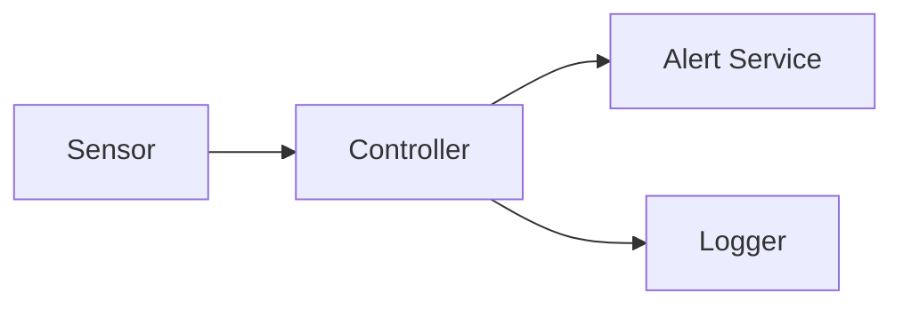

# Software Design Description (SDD)

## Architecture Overview

**Modules**
- **Sensor**: abstracts hardware. Provides `float read()`.
- **Controller**: periodic loop; compares reading to threshold; routes events to Logger and Alert.
- **Logger**: append-only line logger.
- **Alert**: prints alert (placeholder for GPIO/buzzer in real HW).

## Interfaces

- `Sensor::read() -> float` — returns temperature in °C. *(LLR-1)*
- `Logger::write(timestamp, temp, status)` — writes a line per sample. *(LLR-4)*
- `Alert::trigger(temp)` — triggers alert path when condition met. *(HLR-2, LLR-3)*
- `Controller::run(cfg)` — orchestrates the loop with period control and iteration count. *(HLR-1, LLR-5, LLR-6)*

## Data & Configuration

See `docs/configuration.md` for parameter definitions and constraints. *(HLR-4)*

## Timing and Period Control

The controller uses a monotonic clock to schedule the next wake-up and attempts to maintain the period within ±10% on general-purpose OS. *(LLR-5)*

## Error Handling

- Invalid CLI inputs → usage message + non-zero exit. *(LLR-7)*
- I/O errors during logging → non-zero exit with diagnostic. *(LLR-6)*
